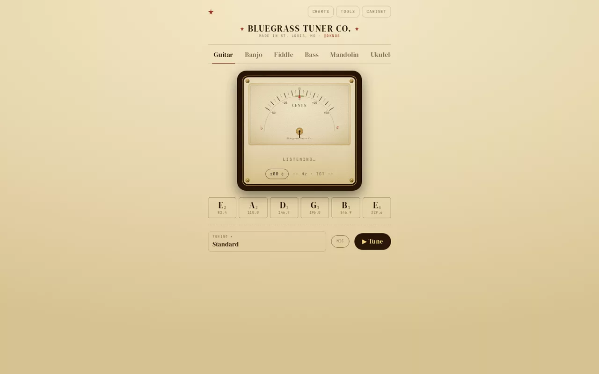

# Bluegrass Tuner

A fast, in-browser instrument tuner and practice workstation. Live mic pitch
detection with three selectable vintage "cabinet" tuner faces, plus a suite of
tools: synths, drum machine, metronome, chord/tuning charts, tab scroller, and
ear-training games.

**[Open Bluegrass Tuner](https://bluegrasstuner.com)**



The interface treats the tuner like a small piece of music-room furniture rather than a generic utility dashboard. Underneath that cabinet is a Rust/WASM pitch detector running off the main thread, so the visual character does not come at the cost of responsiveness.

## Stack

- React 19 + TypeScript + Vite
- Tailwind (CDN) for styling
- **Pitch detection in Rust → WASM, running in an AudioWorklet** (off the main thread)
- PWA (installable, offline-capable via service worker)

No backend, no API keys, no tracking. Everything runs client-side in the browser.

## Tuner cabinets

The tuner gauge has three selectable faces (Tools → Skins Mode 🎨 → Tuner Cabinet),
persisted to `localStorage`:

- **Heirloom** — cream-paper VU needle, walnut frame, brass screws
- **Studio** — rosewood, brass nameplate, big serif note + strobe tape
- **Workshop** — oak + green felt concentric dial

## Pitch detection (Rust → WASM)

The tuner's pitch detector is the **McLeod Pitch Method (MPM)** written in Rust
(`rust/pitch/`), compiled to a ~11KB WASM module, and run inside an
**AudioWorklet** so analysis never blocks the UI thread. MPM stays accurate down
to the lowest strings (bass B0 ≈ 30.87 Hz) where plain autocorrelation
octave-errors.

- `public/pitch.wasm` — the prebuilt module, committed so Cloudflare Pages needs
  **no Rust toolchain** in CI (it just runs `npm run build`).
- `public/pitch-processor.js` — the AudioWorklet that loads the WASM (bytes passed
  via `processorOptions`), accumulates a 4096-sample sliding window, and posts the
  detected frequency back to the React app.

Rebuild the WASM after changing the Rust (requires `rustup target add
wasm32-unknown-unknown`):

```bash
./rust/build.sh                 # builds + copies to public/pitch.wasm
node rust/pitch/test.mjs        # DSP gate: synthetic tones must land within ±1 cent
```

## Develop

```bash
npm install
npm run dev      # http://localhost:3000
npm run build    # → dist/
npm run preview  # serve the production build locally
```

Microphone access is required for tuning; grant it when prompted.

## Overtone (theory course)

The interactive theory course lives at **[/theory/](https://bluegrasstuner.com/theory/)**
and is linked from Charts and Tools. It is a static ES-module app vendored into
`public/theory/` (no videos — the Watch page is a YouTube placeholder).

## Deploy — Cloudflare Pages

Connect this repo in the Cloudflare dashboard (Workers & Pages → Create → Pages →
Connect to Git) with these settings:

| Setting | Value |
|---|---|
| Framework preset | Vite |
| Build command | `npm run build` |
| Build output directory | `dist` |
| Node version | `20` (set env var `NODE_VERSION=20` if needed) |

Then add the custom domain **bluegrasstuner.com** under the project's
*Custom domains* tab. Pushes to `main` auto-build and deploy.

No environment variables are required.
